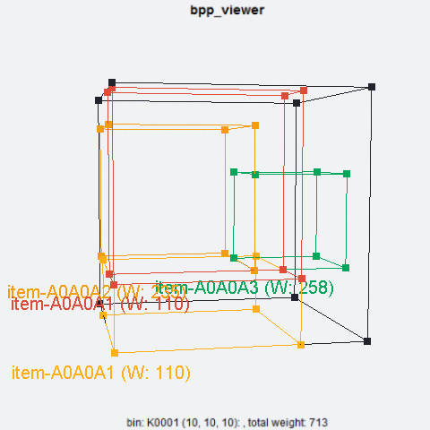

<!-- README.md is generated from README.Rmd. Please edit that file -->
**gbp: a bin packing problem solver**
=====================================

Overview
--------

**gbp** solves **1d - 4d bin packing problem**. The r-package provides a set of **c-level classes and solvers for 1d - 4d bin packing problem**, and an **r-level wrapper over the c-level 4d bin packing problem**. This site demonstrate how to use **r-level** wrapper function **bpp\_solver** in fulfilling the order packing process in business operations. A full discussion of the infrastructure and algorithms can be found in the package associated vignettes.

.

An Example
----------

Imagine yourself as a store manager, and your customers are placing orders on your inventory catalog. The orders are specified in a csv file with header **oid**, **sku**, **l**, **d**, **h**, and **w**. Each order should be uniquely identified by the **order id (oid)**, and each order should include one or more products which each uniquely identified by **stock keeping unit (sku)** with specific **length (l), depth (d), height (h)** and **weight (w)**. This file should then uploaded as order list data, click **download order list table template** for a template table.

The orders are expected to be packed into one or more bins/boxes, specified in a csv file with header **id**, **l**, **d**, and **h**. Each bin should be uniquely indentified by a **bin id (id)** with specific **length (l), depth (d), height (h)** and **weight limit (wlmt)**. This file should then uploaded as bin list data, click **download bin list table template** for a template table.

The objective is **packing each order into the smallest number of bins, and then the smallest bins, with respect to the three dimensional none overlap contraints and weight constraint**. Thus, one big bin is always preferred over two small bins. Click the button **create packing solution** for finding feasible solution using **bpp\_solver**, and then click the **packing solution table** under the **order packing solution** panel to view the full solution. In the packing solution, each **order ticket id (otid)** uniquely identified a set of items in an order that should be packed into a single bin with **bin type (bid)**, and the **x, y, z** provides the coordindate of the item's placement within the bin.

A single order ticket can be visualized by selecting the order ticket id from **select an order ticket id from packing solution** input dialog, clicking **create single ticket 3d view**, and then clicking **packing solution single ticket 3d view** under the **order packing solution** panel. The full solution can be downloaded by click **download packing solution table**.
